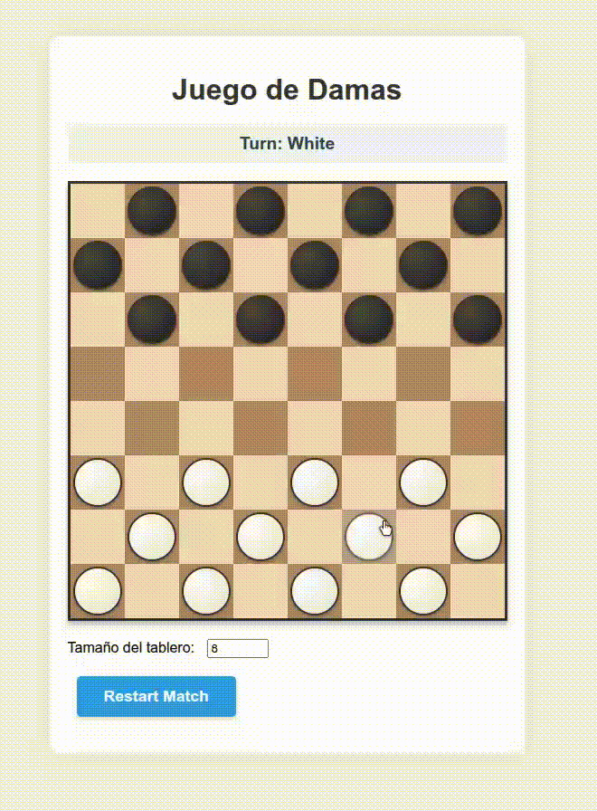
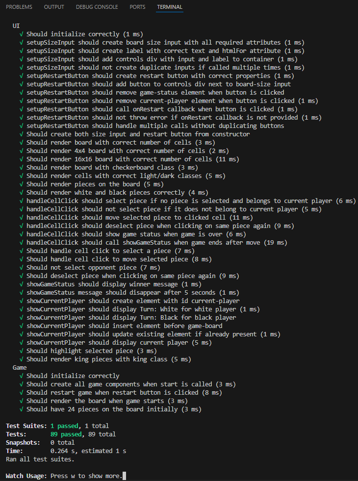

# ♟️ JS Checkers — Classic 1v1 board game in JavaScript

<sub>🗓️ Developed in January 2026</sub>

This project contains the implementation of the **Checkers 1v1 game in JavaScript** designed to practise and evaluate DOM API manipulation: node searching, element iteration and manipulation, and event handling in response to user interaction.  
With the exercises included, the following competences are developed:
- Autonomous and self-directed learning.
- Problem-solving by identifying, analysing, and defining significant elements.
- Appropriate use of JavaScript and modern development tools.
- Application of the most suitable software architecture patterns for each problem.

---

## ✅ Features

- **Game Config**: Class to manage the initial board configuration with a configurable size, player turns, and piece row calculation.
- **Board Generation**: Dynamic board class that generates a 2D array with correctly placed white and black pieces on dark squares.
- **Game Logic**: Full game logic including valid move and capture detection, piece movement, king promotion, turn switching, and game-over checking.
- **UI (Part 1)**: DOM-based UI rendering including board cells, piece display, selection highlighting, and board size/restart controls.
- **UI (Part 2)**: Cell click handling, turn indicator display, and game status messages with auto-dismiss.
- **Game Integration**: Central `Game` class that wires all components together and starts the game.
- **Test-driven**: All exercises are verified via automated tests using **Jest**.

---

## 🛠 Installation & Setup

### 0. Prerequisites
Make sure you have installed:
- **Node.js** (recommended: LTS version)
- **npm** (comes with Node)

Check versions:
```bash
node -v
npm -v
```

### 1. Clone the repository
```bash
git clone https://github.com/marcturu/js-checkers.git
cd js-checkers
```

### 2. Install dependencies
```bash
npm install
```

### 3. Run the tests
```bash
npm test
```

The test environment includes a menu (accessible by pressing the `w` key) that allows you to run tests selectively. For example, pressing `a` lets you manually re-run all tests, and pressing `f` lets you re-run only the tests that have failed.

The test runner will watch for changes in `src/pec4/pec4.js` and re-run automatically on every save.

### 4. Run the web application
```bash
npm run serve
```

Then select the `web` folder inside `src`.   

Another option is to open the ```.html``` file directly in a browser or use **Live Server**. 

The game will typically be avialable at `http://localhost:8080/src/web/`, `http://127.0.0.1:8080/src/web/` or `http://127.0.0.1:5500/src/web/`.

### 5. Check the statements
Take a look at the statements in `README_ca.md` or `README_es.md` to fully understand the game implemented in `src/pec4/pec4.js`.

---

## 📂 Project Structure

```
README_ca.md  ← Statement in catalan
README_es.md  ← Statement in spanish
src/
├── pec4/
│   ├── pec4.js        ← Solution implemented
│   └── pec4.test.js   ← Test file
└── web/
    ├── game.js        ← Game entry point
    ├── index.html     ← App structure
    └── styles.css     ← UI styles
```

---

## 📷 Screenshots

### Gameplay:


### Tests passed:


---

## ⚖️ Copyright & License

© 2026 Marc Turu Roca. All rights reserved.

This project and its contents are the exclusive intellectual property of Marc Turu Roca.  
All rights reserved. No part of this project may be copied, modified, distributed, or used without prior written permission from the author.
